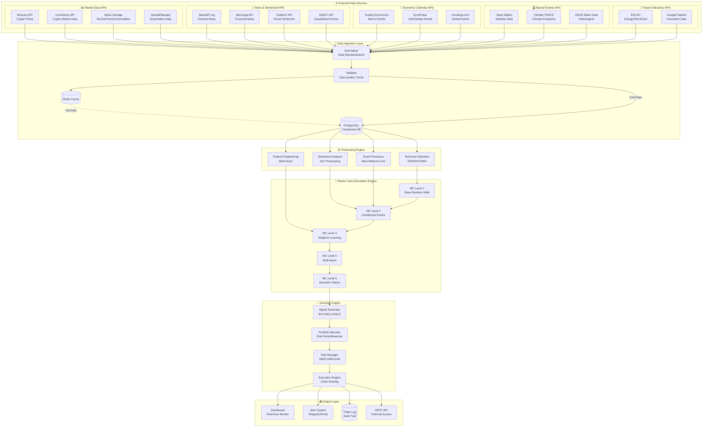
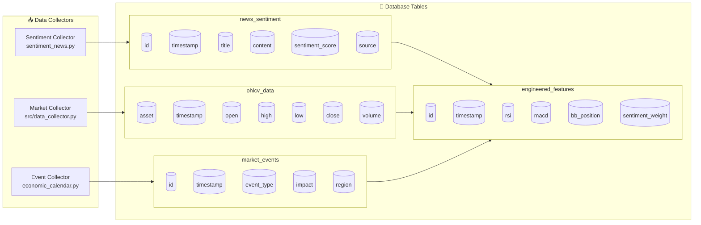
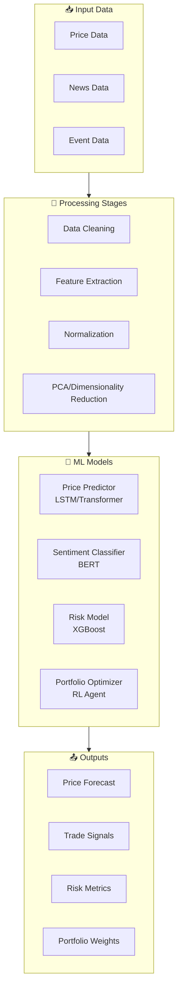
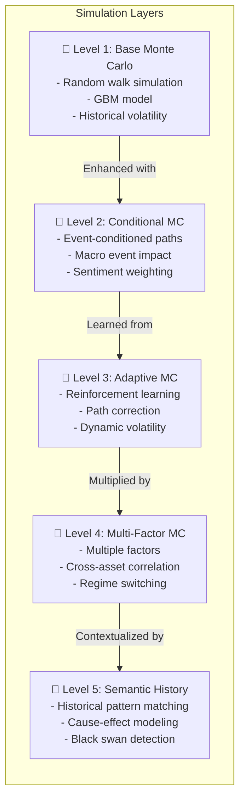
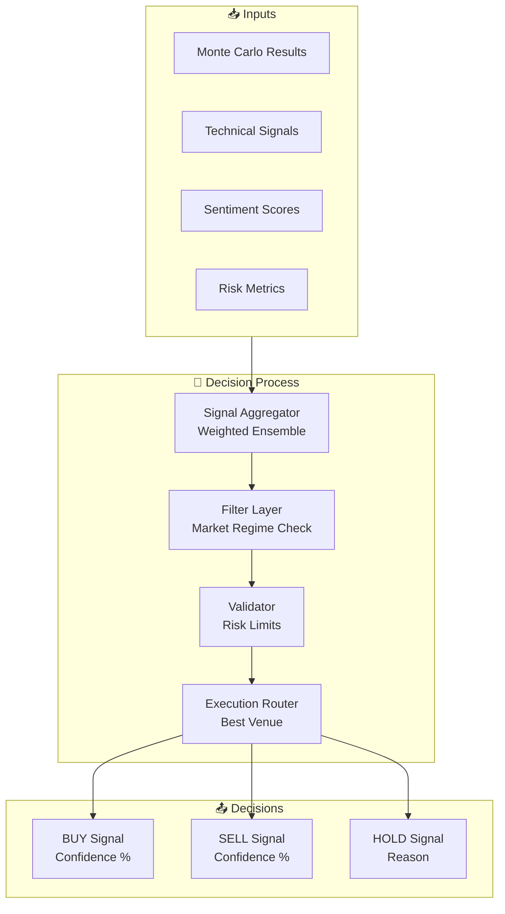
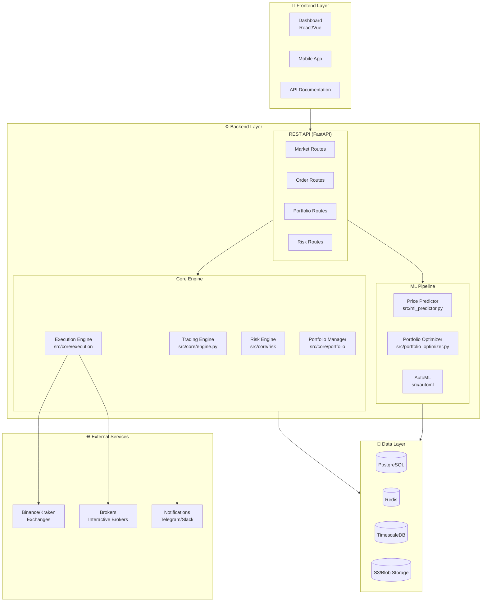

# 🔄 AI Trading System - API Integration Architecture

## Complete Flow Diagram: From APIs to Trading Decisions



---

## 🔄 API-to-Database Integration Schema



---

## ⚙️ Processing Pipeline



---

## 🎲 Monte Carlo Simulation Layers



---

## 🧠 Decision Engine Architecture



---

## 📊 Complete System Architecture



---

## 📋 API Mapping to System Components

| API Category | APIs Used | Source File | Database Table | Usage |
|--------------|-----------|-------------|----------------|-------|
| **Market Data** | Binance, CoinGecko, Alpha Vantage | [`data_collector.py`](data_collector.py) | `ohlcv_data` | Price feeds, historical data |
| **Sentiment** | NewsAPI, Benzinga, Twitter | [`sentiment_news.py`](sentiment_news.py) | `news_sentiment` | Market mood, signal weighting |
| **Economic** | Trading Economics, Investing.com | [`config.py`](config.py) | `market_events` | Event-conditioned MC |
| **Weather** | Open-Meteo, Climate TRACE | [`config.py`](config.py) | `natural_events` | Commodity correlation |
| **Energy** | EIA API | [`config.py`](config.py) | `energy_prices` | Stress testing |
| **Innovation** | Google Patents | [`config.py`](config.py) | `innovation_index` | Long-term scenarios |

---

## 🔄 Data Flow Summary

```
┌─────────────────────────────────────────────────────────────────────────┐
│                         EXTERNAL APIs                                    │
│  ┌──────────┐  ┌──────────┐  ┌──────────┐  ┌──────────┐               │
│  │ Binance  │  │ NewsAPI  │  │ Trading  │  │ Open-    │               │
│  │          │  │          │  │ Economics│  │ Meteo    │               │
│  └────┬─────┘  └────┬─────┘  └────┬─────┘  └────┬─────┘               │
│       │             │             │             │                       │
│       └─────────────┴──────┬──────┴─────────────┘                       │
│                            ▼                                            │
│                   ┌────────────────┐                                    │
│                   │  Normalizer &  │                                    │
│                   │  Validator     │                                    │
│                   └───────┬────────┘                                    │
│                           │                                              │
│                           ▼                                              │
│                   ┌────────────────┐                                    │
│                   │   PostgreSQL   │                                    │
│                   │   + Redis      │                                    │
│                   └───────┬────────┘                                    │
│                           │                                              │
│       ┌───────────────────┼───────────────────┐                       │
│       ▼                   ▼                   ▼                        │
│ ┌──────────┐       ┌──────────┐       ┌──────────┐                   │
│ │Technical │       │Sentiment │       │ Event    │                   │
│ │Indicators│       │Analyzer  │       │Processor │                   │
│ └────┬─────┘       └────┬─────┘       └────┬─────┘                   │
│       │                 │                 │                           │
│       └─────────────────┼─────────────────┘                           │
│                         ▼                                               │
│              ┌────────────────────┐                                     │
│              │ Monte Carlo Engine │                                     │
│              │  (5 Levels)        │                                     │
│              └─────────┬──────────┘                                     │
│                        ▼                                                │
│              ┌────────────────────┐                                     │
│              │ Decision Engine     │                                     │
│              │ Signals + Risk      │                                     │
│              └─────────┬──────────┘                                     │
│                        │                                                │
│                        ▼                                                │
│              ┌────────────────────┐                                     │
│              │ Execution Engine   │                                     │
│              │ + Dashboard        │                                     │
│              └────────────────────┘                                     │
└─────────────────────────────────────────────────────────────────────────┘
```

---

## 🔗 Key Files Reference

| Component | File Path | Description |
|-----------|-----------|-------------|
| Main Engine | [`src/core/engine.py`](src/core/engine.py) | Core trading engine |
| Data Collector | [`data_collector.py`](data_collector.py) | Market data ingestion |
| Sentiment | [`sentiment_news.py`](sentiment_news.py) | News sentiment analysis |
| ML Predictor | [`src/ml_predictor.py`](src/ml_predictor.py) | Price prediction |
| Risk Engine | [`src/risk_engine.py`](src/risk_engine.py) | Risk management |
| Execution | [`src/execution.py`](src/execution.py) | Order execution |
| Portfolio | [`src/portfolio_optimizer.py`](src/portfolio_optimizer.py) | Portfolio optimization |

---

## 🚀 Implementation Status

| Component | Status | Priority |
|-----------|--------|----------|
| ✅ Market Data APIs (Binance) | Implemented | P0 |
| ✅ Sentiment APIs | Implemented | P1 |
| ✅ Economic Calendar | Configured | P1 |
| ⚠️ Weather/Natural Events | Planned | P2 |
| ⚠️ Innovation Patents API | Planned | P3 |
| ✅ Monte Carlo (Level 1-3) | Implemented | P0 |
| 🔄 Monte Carlo (Level 4-5) | In Progress | P1 |
| ✅ Decision Engine | Implemented | P0 |

---

*Document generated for AI Trading System v2.0*
*Architecture version: 2026.02*
