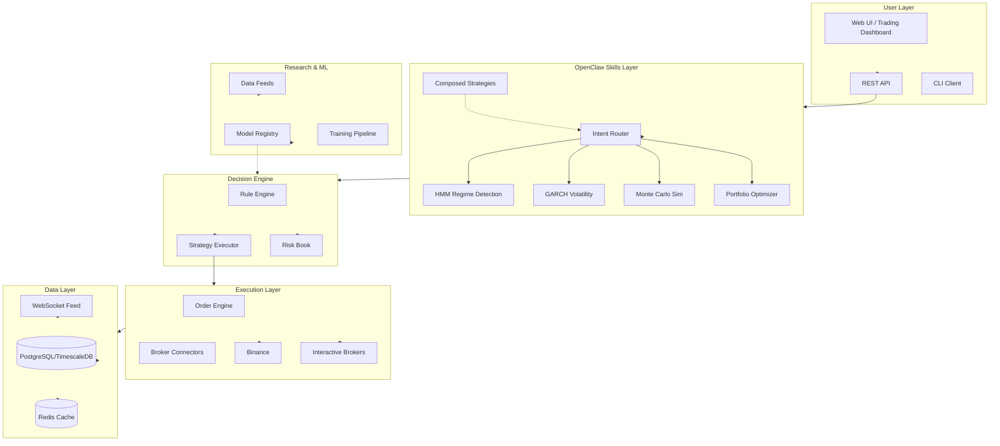
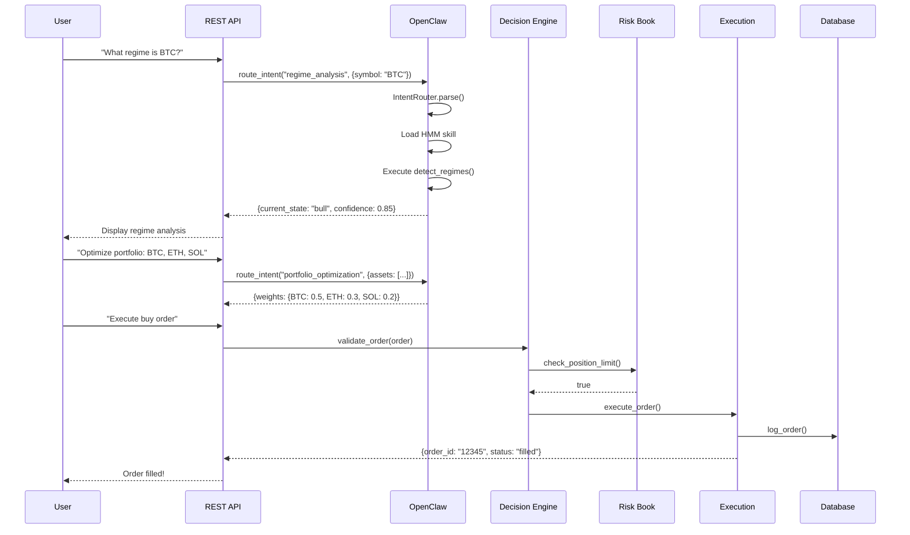
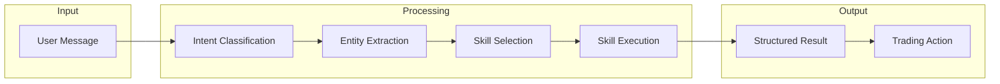
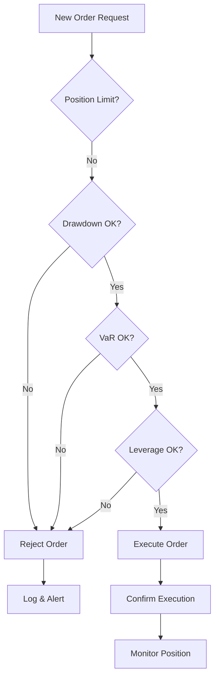
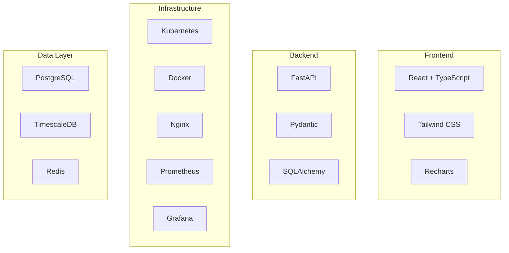

# Architecture Overview

## System Architecture Diagram

## Data Flow Diagram

## Component Interaction

## Risk Management Flow

## Technology Stack

---

## Module Dependencies

| Module | Depends On | Used By |
|--------|------------|---------|
| intent_router | skill_registry | API, Composed Strategies |
| skill_registry | registry_config.yaml | All skills |
| risk_book | None | Decision Engine |
| model_registry | None | Research, Decision |
| composed_strategies | intent_router | API, CLI |

---

## Configuration Files

- `openclaw_skills/registry_config.yaml` - Skill definitions
- `openclaw_skills/skill.yaml` - OpenClaw integration
- `src/risk/limits.json` - Risk parameters
- `data/model_registry.json` - ML model versions

---

*Last updated: 2024*
*Version: 3.0*
