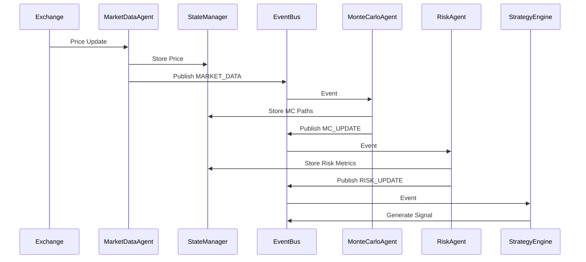
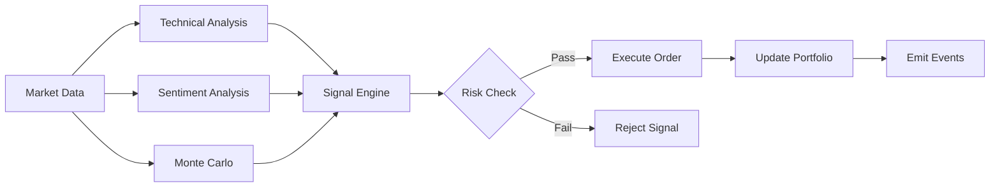

# AI Trading System - Architecture Documentation

## 🏗️ System Overview

The AI Trading System is a professional-grade algorithmic trading platform designed to replicate hedge fund capabilities. It features a multi-agent architecture, event-driven communication, and modular strategy system.

```
┌─────────────────────────────────────────────────────────────────┐
│                    AI Trading System                             │
├─────────────────────────────────────────────────────────────────┤
│  ┌─────────────┐  ┌─────────────┐  ┌─────────────┐              │
│  │  Dashboard  │  │  REST API   │  │   CLI       │              │
│  │  (Dash)     │  │  (FastAPI)  │  │  Interface  │              │
│  └──────┬──────┘  └──────┬──────┘  └──────┬──────┘              │
│         │                │                │                      │
│         └────────────────┼────────────────┘                      │
│                          ▼                                       │
│  ┌───────────────────────────────────────────────────────────┐  │
│  │                    Event Bus                               │  │
│  │              (Pub/Sub Communication)                       │  │
│  └───────────────────────────┬───────────────────────────────┘  │
│                              │                                   │
│  ┌───────────────────────────┼───────────────────────────────┐  │
│  │                     Agents                                 │  │
│  │  ┌─────────────┐  ┌─────────────┐  ┌─────────────┐        │  │
│  │  │ MarketData  │  │ MonteCarlo  │  │    Risk     │        │  │
│  │  │   Agent     │  │   Agent     │  │   Agent     │        │  │
│  │  └─────────────┘  └─────────────┘  └─────────────┘        │  │
│  │  ┌─────────────┐  ┌─────────────┐  ┌─────────────┐        │  │
│  │  │ Supervisor  │  │  Sentiment  │  │  Execution  │        │  │
│  │  │   Agent     │  │   Agent     │  │   Agent     │        │  │
│  │  └─────────────┘  └─────────────┘  └─────────────┘        │  │
│  └───────────────────────────┬───────────────────────────────┘  │
│                              │                                   │
│  ┌───────────────────────────┼───────────────────────────────┐  │
│  │                   Core Components                          │  │
│  │  ┌─────────────┐  ┌─────────────┐  ┌─────────────┐        │  │
│  │  │   State     │  │  Strategy   │  │   AutoML    │        │  │
│  │  │  Manager    │  │   Engine    │  │   Engine    │        │  │
│  │  └─────────────┘  └─────────────┘  └─────────────┘        │  │
│  └───────────────────────────┬───────────────────────────────┘  │
│                              │                                   │
│  ┌───────────────────────────┼───────────────────────────────┐  │
│  │                  External Integrations                     │  │
│  │  ┌─────────────┐  ┌─────────────┐  ┌─────────────┐        │  │
│  │  │  Exchanges  │  │  Data APIs  │  │  Database   │        │  │
│  │  │ Binance/Byb │  │ News/Sentim │  │ PostgreSQL  │        │  │
│  │  └─────────────┘  └─────────────┘  └─────────────┘        │  │
│  └───────────────────────────────────────────────────────────┘  │
└─────────────────────────────────────────────────────────────────┘
```

## 📁 Project Structure

```
ai-trading-system/
├── main.py                     # Main entry point
├── dashboard.py                # Dash dashboard
├── config.py                   # Configuration
│
├── src/
│   ├── core/                   # Core infrastructure
│   │   ├── event_bus.py        # Event-driven communication
│   │   ├── state_manager.py    # State persistence
│   │   ├── engine.py           # Trading engine
│   │   ├── execution/          # Order management
│   │   ├── portfolio/          # Portfolio management
│   │   └── risk/               # Risk management
│   │
│   ├── agents/                 # Multi-agent system
│   │   ├── base_agent.py       # Abstract base class
│   │   ├── agent_marketdata.py # Market data streaming
│   │   ├── agent_montecarlo.py # Monte Carlo simulation
│   │   ├── agent_risk.py       # Risk calculation
│   │   └── agent_supervisor.py # Agent orchestration
│   │
│   ├── strategy/               # Trading strategies
│   │   ├── base_strategy.py    # Strategy interface
│   │   ├── momentum.py         # Momentum strategy
│   │   └── mean_reversion.py   # Mean reversion
│   │
│   ├── automl/                 # AutoML engine
│   │   ├── evolution.py        # Genetic algorithm
│   │   └── automl_engine.py    # Parameter optimization
│   │
│   ├── external/               # External API clients
│   │   ├── api_registry.py     # API factory
│   │   ├── market_data_apis.py # Market data sources
│   │   └── sentiment_apis.py   # Sentiment sources
│   │
│   └── ml/                     # ML models
│       ├── ml_predictor.py     # Price prediction
│       └── ml_enhanced.py      # Enhanced models
│
├── app/                        # FastAPI REST API
│   ├── main.py                 # FastAPI app
│   ├── api/routes/             # API endpoints
│   └── execution/              # Broker connectors
│
├── tests/                      # Test suite
│   ├── test_agents.py          # Agent tests
│   ├── test_strategies.py      # Strategy tests
│   └── test_evolution.py       # AutoML tests
│
├── infra/                      # Infrastructure
│   └── k8s/                    # Kubernetes configs
│       ├── deployment.yaml
│       ├── service.yaml
│       ├── hpa.yaml
│       └── ingress.yaml
│
└── docs/                       # Documentation
    ├── ARCHITECTURE.md
    └── API.md
```

## 🔄 Data Flow

### 1. Market Data Flow



### 2. Signal Generation Flow



## 🤖 Agent Architecture

### Base Agent

All agents inherit from [`BaseAgent`](src/agents/base_agent.py) which provides:

- **Lifecycle Management**: `start()`, `stop()`, `pause()`, `resume()`
- **Event Integration**: `emit_event()`, `subscribe_to()`
- **State Management**: `update_state()`, `get_state()`
- **Metrics Tracking**: `get_metrics()`

```python
class MyAgent(BaseAgent):
    async def run(self):
        # Main agent logic
        while self._running:
            # Process data
            await self.emit_event(EventType.CUSTOM, data)
            await asyncio.sleep(self.interval)
```

### Agent Types

| Agent | Purpose | Interval |
|-------|---------|----------|
| MarketDataAgent | Fetch prices from exchanges | 5s |
| MonteCarloAgent | Run simulations | 30s |
| RiskAgent | Calculate VaR/CVaR | 60s |
| SupervisorAgent | Orchestrate agents | 30s |

## 📊 Strategy System

### Strategy Interface

```python
class BaseStrategy(ABC):
    @abstractmethod
    def generate_signal(self, context: StrategyContext) -> Optional[TradingSignal]:
        pass
```

### Available Strategies

1. **MomentumStrategy**
   - Detects price momentum
   - Volume confirmation
   - MA filter support

2. **MeanReversionStrategy**
   - Z-score based signals
   - Bollinger Bands
   - RSI confirmation

### Signal Flow

```python
# Create context
context = StrategyContext(
    symbol="BTCUSDT",
    prices=price_array,
    volumes=volume_array,
    indicators={"rsi": rsi_array},
    mc_probability_up=0.65,
)

# Generate signal
signal = strategy.generate_signal(context)

if signal:
    # signal.signal_type: BUY/SELL/HOLD
    # signal.confidence: 0.0-1.0
    # signal.strength: STRONG/MODERATE/WEAK
```

## 🎲 Monte Carlo Simulation

### 5-Level Simulation Hierarchy

| Level | Name | Description |
|-------|------|-------------|
| 1 | Base | Geometric Brownian Motion |
| 2 | Conditional | Event-conditioned paths |
| 3 | Adaptive | RL from past accuracy |
| 4 | Multi-Factor | Cross-correlations, regime switching |
| 5 | Semantic | Pattern matching, black swans |

### Usage

```python
agent = MonteCarloAgent(
    name="mc",
    event_bus=bus,
    state_manager=sm,
    config={
        "symbols": ["BTCUSDT"],
        "n_paths": 1000,
        "n_steps": 50,
        "levels": [SimulationLevel.LEVEL_2_CONDITIONAL],
    }
)
```

## 🛡️ Risk Management

### Metrics Calculated

- **VaR (95%, 99%)**: Value at Risk
- **CVaR**: Conditional VaR / Expected Shortfall
- **Max Drawdown**: Maximum peak-to-trough decline
- **Sharpe Ratio**: Risk-adjusted return
- **Sortino Ratio**: Downside risk-adjusted return
- **Volatility**: Annualized volatility

### Risk Levels

```python
class RiskLevel(Enum):
    LOW = "low"        # Score < 3
    MEDIUM = "medium"  # Score 3-4
    HIGH = "high"      # Score 5-6
    CRITICAL = "critical"  # Score >= 7
```

## 🧬 AutoML Evolution

### Genetic Algorithm

```python
engine = EvolutionEngine(EvolutionConfig(
    population_size=20,
    generations=10,
    mutation_rate=0.1,
))

engine.set_param_space("threshold", 0.001, 0.05, "float")
engine.set_param_space("period", 5, 30, "int")

best = engine.evolve(evaluate_fn)
```

### Optimization Process

1. Initialize random population
2. Evaluate fitness for each individual
3. Select parents (tournament selection)
4. Crossover and mutation
5. Create next generation
6. Repeat until convergence

## 🚀 Deployment

### Kubernetes Resources

| Resource | Purpose |
|----------|---------|
| Deployment | Engine, API, Dashboard pods |
| Service | Internal/external access |
| HPA | Auto-scaling |
| Ingress | TLS termination, routing |
| Secrets | API keys, credentials |
| ConfigMap | Configuration values |
| PVC | Persistent storage |

### Deploy Command

```bash
# Create namespace
kubectl apply -f infra/k8s/namespace.yaml

# Deploy secrets (update values first!)
kubectl apply -f infra/k8s/secrets.yaml

# Deploy config
kubectl apply -f infra/k8s/configmap.yaml

# Deploy storage
kubectl apply -f infra/k8s/storage.yaml

# Deploy application
kubectl apply -f infra/k8s/deployment.yaml
kubectl apply -f infra/k8s/service.yaml
kubectl apply -f infra/k8s/hpa.yaml
kubectl apply -f infra/k8s/ingress.yaml
```

## 📈 Performance Targets

| Metric | Target |
|--------|--------|
| Signal Latency | < 100ms |
| Monte Carlo Paths | 1000+ per signal |
| System Uptime | 99.9% |
| API Response | < 50ms |

## 🔧 Configuration

### Environment Variables

```bash
# Trading Mode
TRADING_MODE=paper  # paper, live
USE_TESTNET=true

# Risk Limits
MAX_POSITION_SIZE=0.1
MAX_DAILY_LOSS=0.05
VAR_CONFIDENCE=0.95

# Monte Carlo
MC_PATHS=1000
MC_STEPS=50
```

### Strategy Configuration

```yaml
strategies:
  momentum:
    enabled: true
    weight: 0.4
    params:
      momentum_period: 10
      momentum_threshold: 0.02
```

## 🧪 Testing

```bash
# Run all tests
pytest

# Run specific test file
pytest tests/test_agents.py -v

# Run with coverage
pytest --cov=src tests/
```

## 📚 API Reference

See [API.md](docs/API.md) for complete API documentation.
