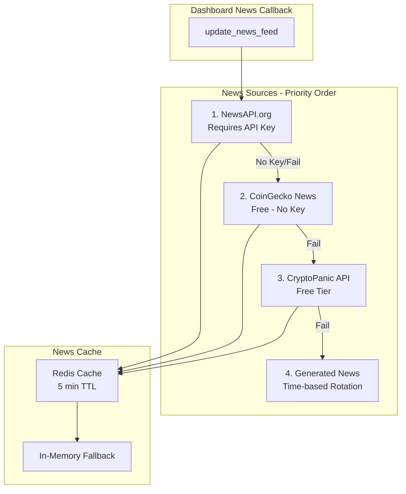

# Fix News Feed Plan

## Problem Analysis

The dashboard news feed is "stuck" showing the same static news because:

1. **Primary Issue**: The [`update_news_feed()`](dashboard.py:1274) callback in `dashboard.py` tries to fetch from CoinGecko News API
2. **Fallback Problem**: When CoinGecko fails, it falls back to **hardcoded sample news** (lines 1300-1306)
3. **No Rotation**: The sample news never changes - it's the same 5 static headlines

### Root Cause Code

```python
# dashboard.py lines 1300-1306
sample_news = [
    {"title": "Bitcoin Surges Past $95K on ETF Inflows", "source": "CoinDesk"},
    {"title": "Ethereum Upgrade Boosts Network Activity", "source": "CoinTelegraph"},
    {"title": "Solana DeFi TVL Reaches New High", "source": "The Block"},
    {"title": "Fed Signals Potential Rate Cut in March", "source": "Reuters"},
    {"title": "Major Bank Launches Crypto Custody Service", "source": "Bloomberg"},
]
```

## Solution Architecture



## Implementation Plan

### Step 1: Create News Service Module

Create a dedicated news service that handles multiple sources with fallback logic.

**File**: `src/services/news_service.py`

```python
class NewsService:
    def __init__(self):
        self.cache = {}
        self.cache_duration = 300  # 5 minutes
        self.sources = [
            self._fetch_from_newsapi,
            self._fetch_from_coingecko,
            self._fetch_from_cryptopanic,
            self._generate_dynamic_news,
        ]
    
    async def get_news(self, limit=10) -> List[Dict]:
        # Try each source in order until one succeeds
        for source in self.sources:
            try:
                news = await source(limit)
                if news:
                    return news
            except Exception:
                continue
        return self._generate_dynamic_news(limit)
```

### Step 2: Add Dynamic News Generation

Replace static sample news with time-based rotation that changes every refresh.

**Key Features**:
- Multiple headline templates
- Time-based variation
- Asset rotation
- Sentiment variation

### Step 3: Update Dashboard Callback

Modify [`dashboard.py`](dashboard.py:1274) to use the new news service.

**Changes**:
1. Import the news service
2. Replace inline news fetching with service call
3. Add proper error handling and logging

### Step 4: Add Configuration Options

Add to [`config.py`](config.py):

```python
NEWS_SETTINGS = {
    'news_api_key': os.getenv('NEWS_API_KEY', ''),
    'cryptopanic_api_key': os.getenv('CRYPTOPANIC_API_KEY', ''),
    'news_refresh_interval': 60,  # seconds
    'news_cache_duration': 300,   # 5 minutes
    'use_simulated_news': os.getenv('USE_SIMULATED_NEWS', 'false').lower() == 'true',
}
```

## Detailed Changes

### File 1: `src/services/news_service.py` (NEW)

Create a unified news service with:
- Multiple source fallback chain
- Proper caching
- Dynamic news generation
- Error handling and logging

### File 2: `dashboard.py` (MODIFY)

Update the `update_news_feed()` callback:

```python
# Before (lines 1274-1316)
def update_news_feed(n, source):
    # ... hardcoded sample_news fallback

# After
def update_news_feed(n, source):
    from src.services.news_service import NewsService
    news_service = NewsService()
    
    try:
        news_items = news_service.get_news_sync(limit=10)
        # ... render news_items
    except Exception as e:
        logger.error(f"News feed error: {e}")
        # Fallback to dynamic generated news
        news_items = news_service.generate_dynamic_news(limit=5)
```

### File 3: `config.py` (MODIFY)

Add news configuration section.

## Testing Plan

1. **Unit Tests**: Test each news source independently
2. **Integration Tests**: Test fallback chain
3. **Manual Testing**: Verify news updates on dashboard refresh

## Priority

| Priority | Task | Effort |
|----------|------|--------|
| HIGH | Add dynamic news generation | Low |
| HIGH | Update dashboard callback | Low |
| MEDIUM | Create news service module | Medium |
| MEDIUM | Add CryptoPanic API support | Medium |
| LOW | Add caching layer | Low |

## Quick Fix Option

For immediate relief, we can just make the sample news dynamic by:

1. Adding more headline templates
2. Using current timestamp to rotate headlines
3. Adding randomization

This can be done in a single file edit to `dashboard.py`.
