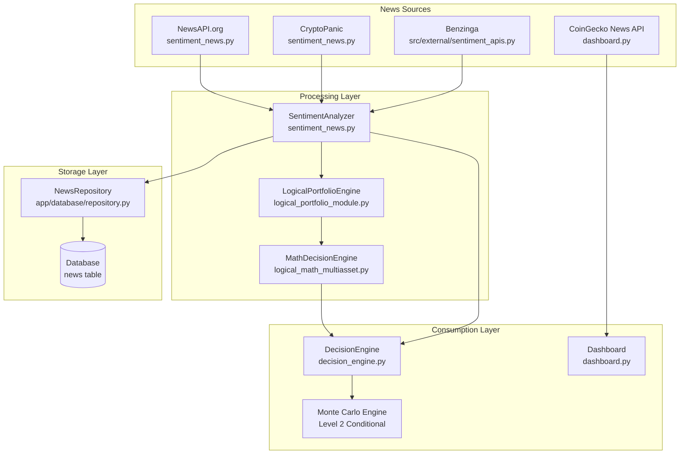

# News Usage Analysis in AI Trading System

## Overview

News is used throughout the system in multiple ways:
1. **Dashboard Display** - Shows news to users
2. **Sentiment Analysis** - Extracts sentiment scores from news
3. **Decision Engine** - Uses news sentiment for trading signals
4. **Monte Carlo Simulations** - Incorporates news in conditional simulations

---

## News Flow Architecture



---

## Key Files and Their Roles

### 1. News Fetching

| File | Function | Description |
|------|----------|-------------|
| [`dashboard.py:1274`](dashboard.py:1274) | `update_news_feed()` | Fetches from CoinGecko for dashboard display |
| [`sentiment_news.py:135`](sentiment_news.py:135) | `fetch_news()` | Main news fetching with NewsAPI fallback |
| [`sentiment_news.py:327`](sentiment_news.py:327) | `fetch_cryptopanic_news()` | CryptoPanic aggregator (free) |
| [`src/external/sentiment_apis.py:35`](src/external/sentiment_apis.py:35) | `NewsAPIClient` | Async NewsAPI client |
| [`src/external/sentiment_apis.py:136`](src/external/sentiment_apis.py:136) | `BenzingaClient` | Benzinga financial news |

### 2. News Processing

| File | Function | Description |
|------|----------|-------------|
| [`sentiment_news.py:92`](sentiment_news.py:92) | `SentimentAnalyzer` | Main sentiment analysis class |
| [`sentiment_news.py:413`](sentiment_news.py:413) | `analyze_asset_sentiment()` | Analyzes sentiment for specific asset |
| [`logical_portfolio_module.py:133`](logical_portfolio_module.py:133) | `LogicalPortfolioEngine` | Logical analysis of news |
| [`logical_portfolio_module.py:253`](logical_portfolio_module.py:253) | `analyze_news()` | Generates signals from news |

### 3. News in Decision Making

| File | Usage | Weight |
|------|-------|--------|
| [`decision_engine.py`](decision_engine.py) | `news_score` in signal generation | 15-20% |
| [`src/decision/filtro_opportunita.py:55`](src/decision/filtro_opportunita.py:55) | `news_score` in semantic analysis | 20% |
| [`src/decision/decision_automatic.py:416`](src/decision/decision_automatic.py:416) | `news_score` in automatic decisions | Variable |

### 4. News Storage

| File | Model/Table | Description |
|------|-------------|-------------|
| [`app/database/models.py:110`](app/database/models.py:110) | `NewsRecord` | SQLAlchemy model for news |
| [`app/database/repository.py:136`](app/database/repository.py:136) | `NewsRepository` | Database operations for news |

---

## News Data Structures

### NewsItem (sentiment_news.py)
```python
@dataclass
class NewsItem:
    title: str
    description: str
    source: str
    url: str
    published_at: datetime
    sentiment: float = 0.0  # -1 to 1
    relevance: float = 0.0   # 0 to 1
    category: str = "general"
```

### NewsItem (logical_portfolio_module.py)
```python
@dataclass
class NewsItem:
    title: str
    source: str
    asset: str = None
    sentiment: float = 0.0
```

### SentimentData (sentiment_news.py)
```python
@dataclass
class SentimentData:
    asset: str
    timestamp: datetime
    sentiment_score: float  # -1 to 1
    confidence: float      # 0 to 1
    news_count: int
    positive_count: int
    negative_count: int
    neutral_count: int
    keywords_matched: List[str]
    sources: List[str]
```

---

## How News Affects Trading Decisions

### Decision Engine Weights
From [`decision_engine.py`](decision_engine.py):
- **Technical Analysis**: 30%
- **Momentum**: 25%
- **Correlation**: 20%
- **Sentiment/News**: 15%
- **ML**: 10%
- **Monte Carlo**: 10%

### Semantic Analysis Weights
From [`src/decision/filtro_opportunita.py`](src/decision/filtro_opportunita.py):
```python
semantic_score = (
    0.20 * trend_signal +
    0.20 * news_score +
    # ... other factors
)
```

---

## News Integration Points

### 1. Dashboard News Feed
```
CoinGecko API → dashboard.py → UI Display
```
- Shows latest crypto news
- Updates on refresh interval
- **Fixed**: Now uses correct `?page=1` parameter

### 2. Sentiment Analysis Pipeline
```
NewsAPI/CryptoPanic → SentimentAnalyzer → SentimentData → DecisionEngine
```
- Fetches news for each asset
- Calculates sentiment score (-1 to +1)
- Weighs by source reliability

### 3. Logical Analysis Pipeline
```
News Feed → LogicalPortfolioEngine → Trading Signals
```
- Extracts asset mentions from news
- Calculates buy/sell signals
- Assigns confidence scores

### 4. Monte Carlo Level 2 (Conditional)
```
News Events → Conditional Paths → Price Projections
```
- Uses news events to condition simulations
- Adjusts probability distributions

---

## Configuration

### Environment Variables
```env
NEWS_API_KEY=your_newsapi_key
TWITTER_BEARER_TOKEN=your_twitter_token
BENZINGA_API_KEY=your_benzinga_key
```

### Config Settings (config.py)
```python
NEWS_SETTINGS = {
    'news_api_key': os.getenv('NEWS_API_KEY', ''),
    'twitter_bearer_token': os.getenv('TWITTER_BEARER_TOKEN', ''),
    'crypto_keywords': [...],
    'gold_keywords': [...],
    'oil_keywords': [...],
}
```

---

## Current Issues Fixed

1. **Dashboard News Feed** - Fixed CoinGecko API URL (added `?page=1`)
2. **Dynamic Fallback** - Added time-based rotation for fallback news

## Potential Improvements

1. **Unified News Service** - Create a single news service that all components use
2. **Caching Layer** - Add Redis caching for news to reduce API calls
3. **Real-time Updates** - WebSocket integration for live news updates
4. **Sentiment Model** - Replace keyword-based sentiment with ML model
5. **Source Reliability** - Track and weight sources by historical accuracy
