# AI Trading System - Project Structure Explained

## Overview

This is a **professional-grade algorithmic trading system** that replicates hedge fund capabilities. It features multi-source data ingestion, ML-powered predictions, 5-level Monte Carlo simulations, institutional risk management, and automated execution.

---

## High-Level Architecture

```mermaid
flowchart TB
    subgraph External[External APIs - 18+ Sources]
        Market[Market Data APIs<br/>Binance, CoinGecko, Alpha Vantage]
        Sentiment[Sentiment APIs<br/>NewsAPI, Twitter, GDELT]
        Macro[Macro Event APIs<br/>Trading Economics, EconPulse]
        Natural[Natural Event APIs<br/>Open-Meteo, USGS, Climate TRACE]
        Innovation[Innovation APIs<br/>EIA, Google Patents]
    end

    subgraph DataLayer[Data Layer]
        Collector[data_collector.py<br/>Market Data Ingestion]
        Loader[data_loader.py<br/>Historical Data]
        Sentiment[sentiment_news.py<br/>NLP Analysis]
    end

    subgraph AnalysisLayer[Analysis Layer]
        TA[technical_analysis.py<br/>RSI, MACD, Bollinger]
        ML[ml_predictor.py<br/>XGBoost, LightGBM, RF]
        HMM[hmm_regime.py<br/>Regime Detection]
    end

    subgraph DecisionLayer[Decision Layer]
        Decision[decision_engine.py<br/>Signal Generation]
        MC[Monte Carlo Engine<br/>5-Level Simulation]
        AutoML[automl/<br/>Strategy Evolution]
    end

    subgraph RiskLayer[Risk Layer]
        Risk[risk_engine.py<br/>VaR, CVaR, GARCH]
        Guard[risk_guard.py<br/>Position Limits]
        FatTail[fat_tail_risk.py<br/>Black Swan Detection]
    end

    subgraph ExecutionLayer[Execution Layer]
        Exec[execution.py<br/>Order Management]
        BestExec[best_execution.py<br/>Slippage Control]
        TCA[tca.py<br/>Transaction Cost Analysis]
    end

    subgraph APILayer[API Layer]
        FastAPI[app/main.py<br/>FastAPI REST API]
        Dashboard[dashboard.py<br/>Dash Dashboard]
    end

    External --> DataLayer
    DataLayer --> AnalysisLayer
    AnalysisLayer --> DecisionLayer
    DecisionLayer --> RiskLayer
    RiskLayer --> ExecutionLayer
    ExecutionLayer --> APILayer
```



---

## Directory Structure

### Root Level Files

| File | Purpose |
|------|---------|
| [`main.py`](main.py) | Main entry point for the trading engine |
| [`dashboard.py`](dashboard.py) | Dash dashboard with 22 live callbacks |
| [`decision_engine.py`](decision_engine.py) | Signal generation + Monte Carlo 5 levels |
| [`data_collector.py`](data_collector.py) | Market data ingestion using ccxt |
| [`technical_analysis.py`](technical_analysis.py) | Technical indicators: RSI, MACD, Bollinger |
| [`sentiment_news.py`](sentiment_news.py) | Sentiment analysis using NLP |
| [`ml_predictor.py`](ml_predictor.py) | ML price prediction models |
| [`config.py`](config.py) | Configuration and settings |
| [`auto_trader.py`](auto_trader.py) | Automated trading logic |
| [`api_server.py`](api_server.py) | API server implementation |

---

### `/src` - Core Source Code

#### `/src/core/` - Core Engine Components
| Module | Description |
|--------|-------------|
| [`engine.py`](src/core/engine.py) | Core trading engine orchestrator |
| [`event_bus.py`](src/core/event_bus.py) | Event-driven architecture with Pub/Sub |
| [`state_manager.py`](src/core/state_manager.py) | State persistence using SQLite |

#### `/src/core/execution/` - Order Execution
| Module | Description |
|--------|-------------|
| [`best_execution.py`](src/core/execution/best_execution.py) | Best execution routing with slippage control |
| [`order_manager.py`](src/core/execution/order_manager.py) | Order lifecycle management |
| [`orderbook_simulator.py`](src/core/execution/orderbook_simulator.py) | Order book simulation for backtesting |
| [`tca.py`](src/core/execution/tca.py) | Transaction Cost Analysis |
| [`broker_interface.py`](src/core/execution/broker_interface.py) | Abstract broker interface |

#### `/src/core/risk/` - Risk Management
| Module | Description |
|--------|-------------|
| [`risk_engine.py`](src/core/risk/risk_engine.py) | Core risk calculations |
| [`institutional_risk_engine.py`](src/core/risk/institutional_risk_engine.py) | Institutional-grade risk management |
| [`fat_tail_risk.py`](src/core/risk/fat_tail_risk.py) | Fat-tail risk and black swan detection |
| [`multiasset_cvar.py`](src/core/risk/multiasset_cvar.py) | Multi-asset CVaR calculations |
| [`volatility_models.py`](src/core/risk/volatility_models.py) | GARCH/EGARCH volatility models |

#### `/src/core/portfolio/` - Portfolio Management
| Module | Description |
|--------|-------------|
| [`portfolio_manager.py`](src/core/portfolio/portfolio_manager.py) | Multi-asset portfolio management |

#### `/src/external/` - External API Clients
| Module | Description |
|--------|-------------|
| [`api_registry.py`](src/external/api_registry.py) | Central API factory and dispatcher |
| [`market_data_apis.py`](src/external/market_data_apis.py) | Binance, CoinGecko, Alpha Vantage, Quandl |
| [`sentiment_apis.py`](src/external/sentiment_apis.py) | NewsAPI, Benzinga, Twitter, GDELT |
| [`macro_event_apis.py`](src/external/macro_event_apis.py) | Trading Economics, EconPulse |
| [`natural_event_apis.py`](src/external/natural_event_apis.py) | Open-Meteo, Climate TRACE, USGS |
| [`innovation_apis.py`](src/external/innovation_apis.py) | EIA, Google Patents, Lens.org |
| [`bybit_client.py`](src/external/bybit_client.py) | Bybit exchange connector |
| [`okx_client.py`](src/external/okx_client.py) | OKX exchange connector |

#### `/src/automl/` - AutoML Engine
| Module | Description |
|--------|-------------|
| [`automl_engine.py`](src/automl/automl_engine.py) | AutoML orchestration |
| [`evolution.py`](src/automl/evolution.py) | Genetic algorithm for strategy evolution |
| [`strategy_evolution_manager.py`](src/automl/strategy_evolution_manager.py) | Strategy evolution management |

#### `/src/strategy/` - Trading Strategies
| Module | Description |
|--------|-------------|
| [`base_strategy.py`](src/strategy/base_strategy.py) | Abstract base strategy class |
| [`mean_reversion.py`](src/strategy/mean_reversion.py) | Mean reversion strategy |
| [`momentum.py`](src/strategy/momentum.py) | Momentum trading strategy |

#### `/src/agents/` - Multi-Agent System
| Module | Description |
|--------|-------------|
| [`base_agent.py`](src/agents/base_agent.py) | Base agent class |
| [`agent_marketdata.py`](src/agents/agent_marketdata.py) | Market data agent |
| [`agent_montecarlo.py`](src/agents/agent_montecarlo.py) | Monte Carlo simulation agent |
| [`agent_risk.py`](src/agents/agent_risk.py) | Risk management agent |
| [`agent_supervisor.py`](src/agents/agent_supervisor.py) | Supervisor agent for coordination |

#### `/src/live/` - Live Trading
| Module | Description |
|--------|-------------|
| [`binance_multi_ws.py`](src/live/binance_multi_ws.py) | Binance multi-stream WebSocket |
| [`live_streaming_manager.py`](src/live/live_streaming_manager.py) | Real-time data streaming |
| [`portfolio_live.py`](src/live/portfolio_live.py) | Live portfolio management |
| [`risk_engine.py`](src/live/risk_engine.py) | Live risk engine |
| [`telegram_notifier.py`](src/live/telegram_notifier.py) | Telegram notifications |

#### `/src/hft/` - High-Frequency Trading
| Module | Description |
|--------|-------------|
| [`hft_env.py`](src/hft/hft_env.py) | HFT environment |
| [`hft_simulator.py`](src/hft/hft_simulator.py) | HFT simulation |
| [`hft_trading_engine.py`](src/hft/hft_trading_engine.py) | HFT trading engine |

---

### `/app` - FastAPI REST API

#### `/app/api/routes/` - API Endpoints
| Module | Endpoints |
|--------|-----------|
| [`health.py`](app/api/routes/health.py) | Health check endpoints |
| [`market.py`](app/api/routes/market.py) | Market data endpoints |
| [`orders.py`](app/api/routes/orders.py) | Order management endpoints |
| [`portfolio.py`](app/api/routes/portfolio.py) | Portfolio endpoints |
| [`risk.py`](app/api/routes/risk.py) | Risk metrics endpoints |
| [`strategy.py`](app/api/routes/strategy.py) | Strategy management endpoints |

#### `/app/execution/` - Execution Layer
| Module | Description |
|--------|-------------|
| [`broker_connector.py`](app/execution/broker_connector.py) | Broker connection management |
| [`execution_engine.py`](app/execution/execution_engine.py) | Execution engine |
| [`order_manager.py`](app/execution/order_manager.py) | Order management |

#### `/app/execution/connectors/` - Broker Connectors
| Module | Description |
|--------|-------------|
| [`binance_connector.py`](app/execution/connectors/binance_connector.py) | Binance connector |
| [`ib_connector.py`](app/execution/connectors/ib_connector.py) | Interactive Brokers connector |
| [`paper_connector.py`](app/execution/connectors/paper_connector.py) | Paper trading connector |

#### `/app/database/` - Database Layer
| Module | Description |
|--------|-------------|
| [`models.py`](app/database/models.py) | SQLAlchemy models |
| [`repository.py`](app/database/repository.py) | Database repository |
| [`async_repository.py`](app/database/async_repository.py) | Async database operations |
| [`timescale_models.py`](app/database/timescale_models.py) | TimescaleDB models |

---

## Key Features

### 1. Multi-Source Data Ingestion (18 APIs)
- **Market Data**: Binance, CoinGecko, Alpha Vantage, Quandl, CoinMarketCap
- **Sentiment**: NewsAPI, Benzinga, Twitter/X, GDELT
- **Macro Events**: Trading Economics, EconPulse, Investing.com
- **Natural Events**: Open-Meteo, Climate TRACE, USGS
- **Innovation**: EIA, Google Patents, Lens.org

### 2. Monte Carlo Simulation (5 Levels)
1. **Base**: Geometric Brownian Motion random walks
2. **Conditional**: Event-conditioned paths (macro + sentiment)
3. **Adaptive**: Reinforcement learning from past accuracy
4. **Multi-Factor**: Natural events, cross-correlations, regime switching
5. **Semantic History**: Pattern matching, black swan detection, fat tails

### 3. Decision Engine
- Weighted ensemble: Technical (30%) + Momentum (25%) + Correlation (20%) + Sentiment (15%) + ML (10%) + Monte Carlo (10%)
- ML Predictor (XGBoost/LightGBM/Random Forest)
- Confidence scoring with strength labels (STRONG/MODERATE/WEAK)

### 4. Institutional Risk Management
- Value at Risk (VaR): Historical, Parametric, Monte Carlo
- Conditional VaR (CVaR / Expected Shortfall)
- GARCH/EGARCH/GJR-GARCH volatility models
- Fat-tail risk analysis
- Position limits, drawdown controls

### 5. Execution Engine
- Best execution routing with slippage control
- Order book simulation
- Transaction Cost Analysis (TCA)
- Paper trading + Binance Testnet + Live execution

---

## Running the Application

### Start Dashboard
```bash
python dashboard.py
# Open http://127.0.0.1:8050
```

### Start Trading Engine
```bash
python main.py
```

### Start FastAPI Server
```bash
uvicorn app.main:app --reload
```

### Run Tests
```bash
# Run all tests
pytest

# Run with coverage
pytest --cov=src --cov=app

# Run specific test modules
python test_core.py
python test_execution.py
python test_binance_testnet.py
```

### Docker Deployment
```bash
docker-compose up -d
```

---

## Configuration

Create a `.env` file with your API keys:

```env
# Required
BINANCE_API_KEY=your_key
BINANCE_SECRET_KEY=your_secret
USE_BINANCE_TESTNET=true

# Recommended
NEWSAPI_KEY=your_newsapi_key
ALPHA_VANTAGE_API_KEY=your_av_key

# Optional
TRADING_ECONOMICS_API_KEY=your_te_key
EIA_API_KEY=your_eia_key
TWITTER_BEARER_TOKEN=your_twitter_token
```

---

## Technology Stack

| Category | Technologies |
|----------|-------------|
| **Language** | Python 3.11+ |
| **Web Framework** | FastAPI, Flask, Dash |
| **ML/DL** | scikit-learn, XGBoost, LightGBM, PyTorch, Transformers |
| **Data** | pandas, numpy, ccxt |
| **Database** | SQLAlchemy, PostgreSQL, TimescaleDB, Redis |
| **Brokers** | Binance, Bybit, OKX, Interactive Brokers |
| **Testing** | pytest, pytest-asyncio |
| **Deployment** | Docker, Kubernetes |

---

## Current Status

The repository is on the `main` branch and up to date with `origin/main`. There are some uncommitted local changes:
- New file: `app/database/async_repository.py`
- Modified: `src/automl/evolution.py`
- Modified: `src/core/state_manager.py`
- Modified: `src/strategy/base_strategy.py`
